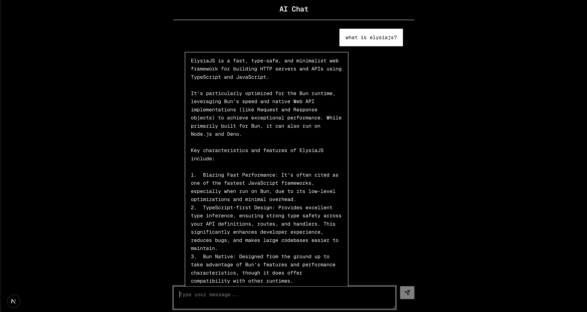

# AI Chat

An AI chat application built with Elysia, Next.js, and Google Gemini. This project explores Elysia framework fundamentals and streaming AI responses.

## Screenshot

## Tech Stack

-   **Backend**: Elysia, Google Gemini, Vercel AI SDK
-   **Frontend**: Next.js, Tailwind CSS, Shadcn/UI
